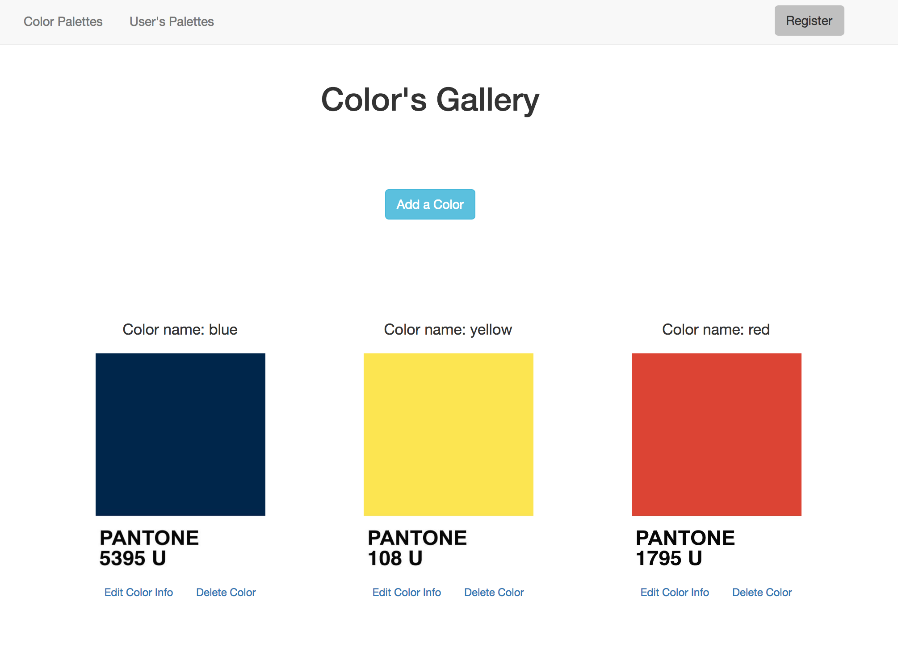

# COLOR PALETTE APP

Full Stack App built on Rails where the user can create their username, create colors, edit the colors and delete them.

[Link to the live site] (https://color-palettes-frontend.herokuapp.com) / 
[Link to the back-end repo] (https://github.com/Steph-Blondet/colorpalette_app_api)

## Technologies Used
- Angular JS
- Postgress
- Ruby
- Ruby on Rails
- Node.js and Express
- CORS configuration
- HTML, CSS and JavaScript
- Bootstrap

## Desktop View

------------------------------------------
*This full stack web application was the fourth project of the Full Stack Web Development Immersive Program at General Assembly. *Designed and Developed by Stephanie Blondet, February 2017.
